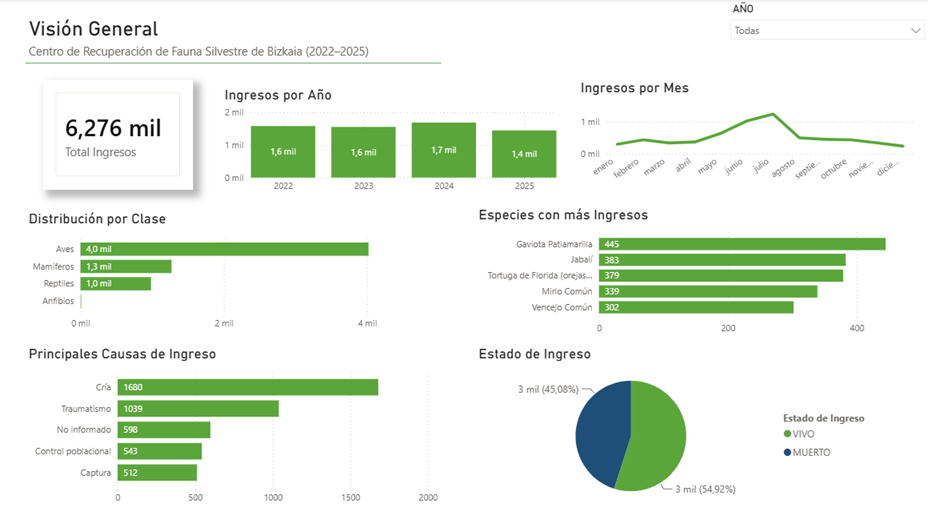
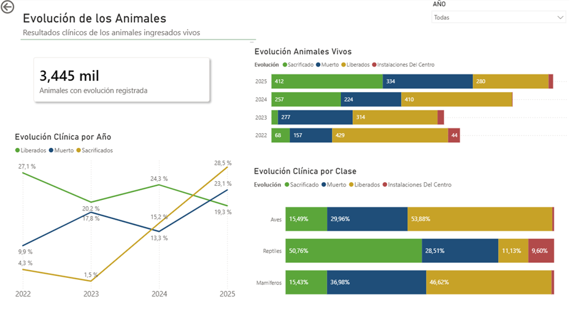
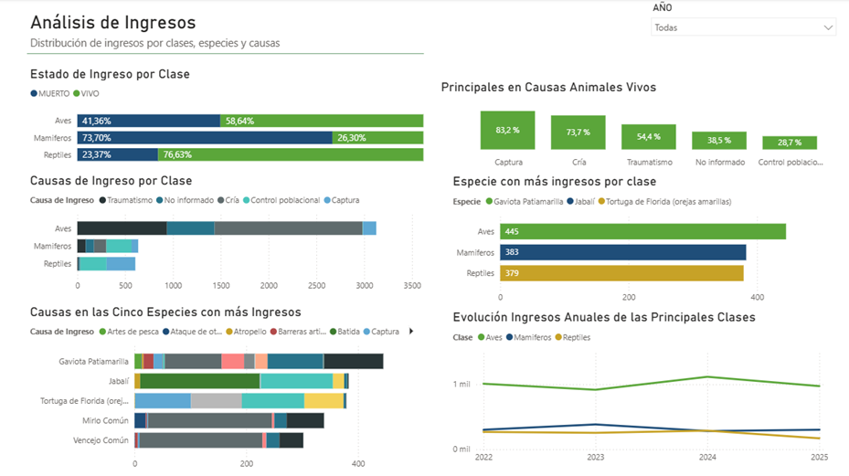
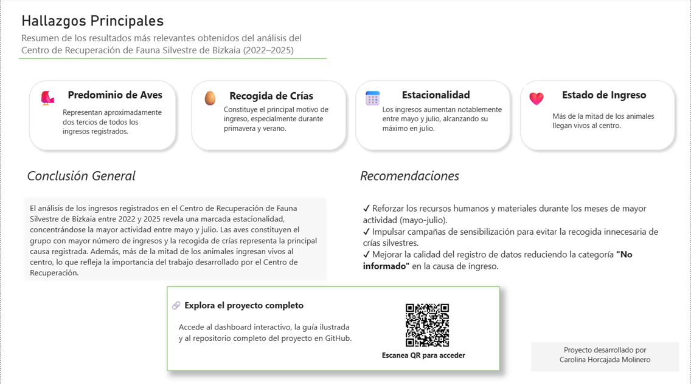
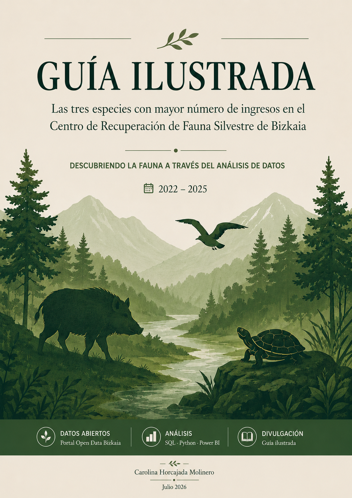
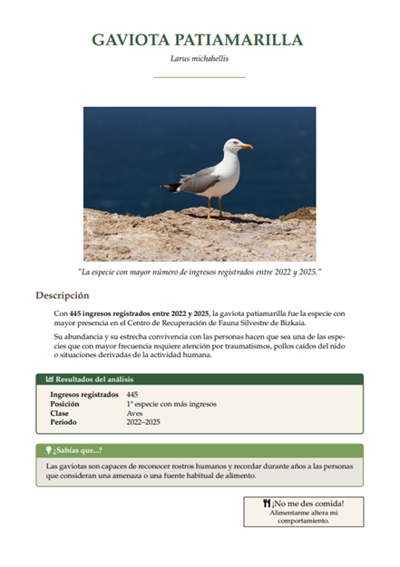
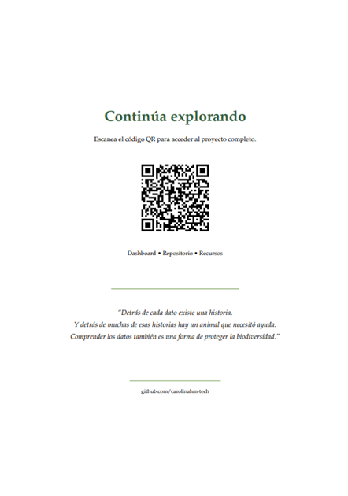

🌍 **Language**

- 🇬🇧 English (this document)
- 🇪🇸 [Versión en Español](README.md)

# 🐦 Bizkaia Wildlife Recovery Centre (2022–2025)

A complete **Data Analytics** project developed using public data from the **Bizkaia Wildlife Recovery Centre**.

This project covers the full lifecycle of a real-world data analytics workflow, from collecting and preparing raw data to building an interactive Power BI dashboard and designing an illustrated guide to communicate the results in a clear and accessible way.

The project combines **Python**, **SQL**, **Power BI** and **LaTeX** to transform open data into meaningful insights about wildlife admissions in Bizkaia.

---

# ⭐ Highlights

- ✔ Open data obtained from the Open Data Bizkaia portal.
- ✔ Data cleaning and standardization using Python.
- ✔ Data quality validation before analysis.
- ✔ SQL analytical queries.
- ✔ Interactive dashboard built in Power BI.
- ✔ Illustrated guide fully designed in LaTeX (Overleaf).
- ✔ Complete technical documentation available on GitHub.

---

# 🎯 Project Goals

The objective of this project is to analyze wildlife admissions recorded at the **Bizkaia Wildlife Recovery Centre** between **2022 and 2025** in order to answer questions such as:

- Which species are admitted most frequently?
- During which periods of the year do most admissions occur?
- What are the main admission causes?
- How does the condition of admitted animals evolve over time?
- Which patterns help us better understand wildlife in the region?

Beyond the technical analysis, the project also aims to transform the results into an accessible illustrated guide for anyone interested in biodiversity.

The guide presents the **three most frequently admitted species**, together with visual summaries, interesting facts and conservation recommendations based on the analysis.

---

# 📂 Dataset

## Data source

Open Data Bizkaia

Public records from the Bizkaia Wildlife Recovery Centre.

## Study period

**2022–2025**

The dataset contains more than **13,000 wildlife admission records**.

Each record includes information such as:

- Species
- Zoological class
- Admission cause
- Admission status
- Animal outcome
- Admission dates
- Collection location
- Additional variables associated with each record

---

# ✅ Data Validation & Preparation

Before starting the analysis, the raw data obtained from the Open Data Bizkaia portal required a complete preparation and validation process.

The main tasks included:

- Fixing character encoding issues using Python.
- Standardizing and merging datasets from 2022 to 2025.
- Reviewing columns, categories and inconsistent values.
- Preparing the final dataset for SQL analysis and Power BI visualization.
- Validating information by comparing variables across different years.

As part of the validation process, several observations were discussed with the Open Data Bizkaia team to ensure the reliability of the information used throughout the project.

This process resulted in a cleaner, more consistent dataset and therefore more reliable analytical results.

---

# ⚙ Methodology

The project followed the workflow below:

```text
Open Data
      │
      ▼
Data Cleaning
(Python + SQL)
      │
      ▼
Data Validation
      │
      ▼
Exploratory Analysis
      │
      ▼
Interactive Dashboard
(Power BI)
      │
      ▼
Illustrated Guide
(LaTeX)
```

---

# 📊 Power BI Dashboard

The dashboard is organized into multiple report pages, allowing users to explore the dataset from different perspectives.

## 📈 General Overview



Main indicators include:

- Total admissions
- Annual evolution
- Monthly distribution
- Year-to-year comparison

---

## 📊 Temporal Analysis



Analysis includes:

- Admission status
- Animal outcomes
- Temporal trends

---

## 🔍 Species Analysis



Allows exploration of:

- Zoological classes
- Species
- Main admission causes
- Record distribution

---

## 📌 Key Findings



A visual summary of the main insights obtained during the analysis.

---

# 📖 Illustrated Guide

Besides the dashboard, the project also includes an illustrated guide entirely designed in **LaTeX (Overleaf)**.

The guide summarizes the main analytical results using species profiles, charts and educational content intended to make biodiversity information accessible to a broader audience.

<p align="center">







</p>

---

# 🔎 Key Findings

- 🦅 Birds represent the zoological class with the highest number of admissions.
- 🐦 The Yellow-legged Gull was the most frequently admitted species.
- 🌱 Spring and summer concentrate the highest admission volume.
- 🚑 The breeding season is the leading admission cause.
- ❤️ More than half of the animals arrive alive at the recovery centre.
- 🌍 The results reveal the direct impact of human activity on wildlife.

---

# 🛠 Technologies

| Technology | Purpose |
|------------|----------|
| Python | Data cleaning and preparation |
| SQL | Analytical queries |
| Power BI | Interactive dashboard |
| LaTeX (Overleaf) | Illustrated guide |
| GitHub | Documentation and version control |
| Google Sheets | Data preparation support |

---

## 📁 Project structure

```text
recuperacion-fauna-bizkaia/
│
├── dashboard/
│   └── Power BI dashboard
│
├── guia/
│   └── Illustrated guide
│
├── images/
│   └── Project visual resources
│
├── notebooks/
│   └── notebook_data_preparation.ipynb
│
├── .gitignore
├── LICENSE
├── README.md
└── README_EN.md
```

The datasets used during the analysis are not included in the repository.

---

# 💡 What I Learned

This project allowed me to work with a real public dataset while facing many of the challenges commonly encountered in professional data analytics projects.

Throughout its development I strengthened my skills in:

- Data cleaning
- Data validation
- Exploratory analysis
- SQL querying
- Dashboard design
- Technical documentation
- Scientific communication through data visualization

Perhaps the most valuable lesson was learning that reliable analyses begin with reliable data. Validating and understanding the dataset before drawing conclusions proved to be just as important as the analysis itself.

---

# 📬 Contact

<p align="center">

<a href="https://github.com/carolinahm-tech">

</a>

<a href="https://www.kaggle.com/wildina">

</a>

<a href="https://www.linkedin.com/in/carolina-hm">

</a>

</p>
